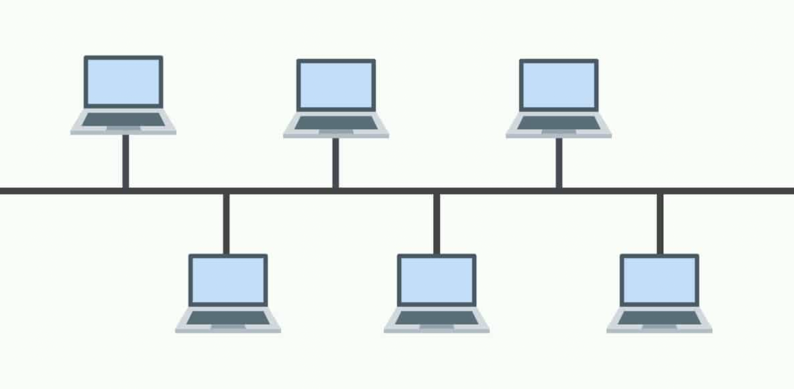

## BUS Topology

Bus topology is a network type in which every computer and network device is connected to single cable. When it has exactly two endpoints, then it is called Linear Bus topology.It transmits data only in one direction.Every device is connected to a single cable

### Disadvantage

1) Cables fails then whole network fails.
2) Cable has a limited length.

## RING Topology

It is called ring topology because it forms a ring as each computer is connected to another computer, with the last one connected to the first. Exactly two neighbours for each device.Data is transferred in a sequential manner that is bit by bit. Data transmitted, has to pass through each node of the network, till the destination node.The transmission is unidirectional, but it can be made bidirectional by having 2 connections between each Network Node, it is called Dual Ring Topology.

### Disadvantage

1) Failure of one computer disturbs the whole network.
2) Adding or deleting the computers disturbs the network activity.

## STAR Topology

In this type of topology all the computers are connected to a single hub through a cable. This hub is the central node and all others nodes are connected to the central node. Every node has its own dedicated connection to the hub. Hub acts as a repeater for data flow. Can be used with twisted pair, Optical Fibre or coaxial cable.

### Disadvantage

1) Cost of installation is high.
2) Expensive to use.
3) Performance is based on the hub that is it depends on its capacity.

## TREE Topology

It has a root node and all other nodes are connected to it forming a hierarchy. It is also called hierarchical topology. It should at least have three levels to the hierarchy. Ideal if workstations are located in groups. Used in Wide Area Network.

### Disadvantage

1) Heavily cabled.
2) Costly.
3) If more nodes are added maintenance is difficult.
4) Central hub fails, network fails.

## MESH Topology

The same data is transmitted to all the network nodes, hence no routing logic is required. The network is robust, and the its very unlikely to lose the data. But it leads to unwanted load over the network.

### Disadvantage

1) Installation and configuration is difficult.
2) Cabling cost is more.
3) Bulk wiring is required.
