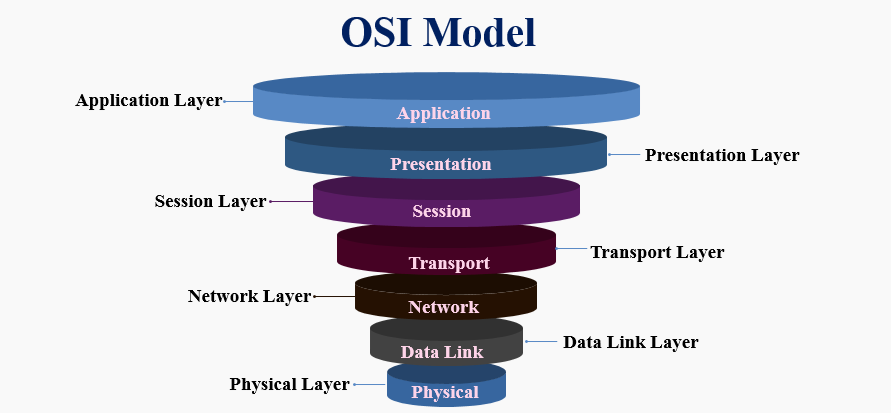

## OSI Model

The Open Systems Interconnection (OSI) model describes seven layers that computer systems use to communicate over a network. It was the first standard model for network communications, adopted by all major computer and telecommunication companies in the early 1980s

The modern Internet is not based on OSI, but on the simpler TCP/IP model. However, the OSI 7-layer model is still widely used, as it helps visualize and communicate how networks operate, and helps isolate and troubleshoot networking problems.

### Now let's talk about the different layers of the OSI model, one by one

There are 7-layers in OSI model :

1) Physical Layer
2) Data-Link Layer
3) Network Layer
4) Transport Layer
5) Session Layer
6) Presentation Layer
7) Application Layer

## Physical Layer

The main functionality of the physical layer is to transmit the individual bits from one node to another node.It defines the connector, the electrical cable or wireless technology connecting the devices, and is responsible for transmission of the raw data, which is simply a series of 0s and 1s, while taking care of bit rate control.

### Data Link Layer

The data link layer establishes and terminates a connection between two physically-connected nodes on a network. It breaks up packets into frames and sends them from source to destination. This layer is composed of two parts—Logical Link Control (LLC), which identifies network protocols, performs error checking and synchronizes frames, and Media Access Control (MAC) which uses MAC addresses to connect devices and define permissions to transmit and receive data.

### Functions of the Data-link layer

Framing: The data link layer translates the physical's raw bit stream into packets known as Frames. The Data link layer adds the header and trailer to the frame. The header which is added to the frame contains the hardware destination and source address.
OSI Model

Physical Addressing: The Data link layer adds a header to the frame that contains a destination address. The frame is transmitted to the destination address mentioned in the header.

Flow Control: Flow control is the main functionality of the Data-link layer. It is the technique through which the constant data rate is maintained on both the sides so that no data get corrupted. It ensures that the transmitting station such as a server with higher processing speed does not exceed the receiving station, with lower processing speed.

Error Control: Error control is achieved by adding a calculated value CRC (Cyclic Redundancy Check) that is placed to the Data link layer's trailer which is added to the message frame before it is sent to the physical layer. If any error seems to occurr, then the receiver sends the acknowledgment for the retransmission of the corrupted frames.

Access Control: When two or more devices are connected to the same communication channel, then the data link layer protocols are used to determine which device has control over the link at a given time.

## Network Layer

The network layer has two main functions. One is breaking up segments into network packets, and reassembling the packets on the receiving end. The other is routing packets by discovering the best path across a physical network. The network layer uses network addresses (typically Internet Protocol addresses) to route packets to a destination node.

## Transport Layer

The transport layer takes data transferred in the session layer and breaks it into “segments” on the transmitting end. It is responsible for reassembling the segments on the receiving end, turning it back into data that can be used by the session layer. The transport layer carries out flow control, sending data at a rate that matches the connection speed of the receiving device, and error control, checking if data was received incorrectly and if not, requesting it again.

## Session Layer

The session layer creates communication channels, called sessions, between devices. It is responsible for opening sessions, ensuring they remain open and functional while data is being transferred, and closing them when communication ends. The session layer can also set checkpoints during a data transfer—if the session is interrupted, devices can resume data transfer from the last checkpoint.

## Presentation Layer

The presentation layer prepares data for the application layer. It defines how two devices should encode, encrypt, and compress data so it is received correctly on the other end. The presentation layer takes any data transmitted by the application layer and prepares it for transmission over the session layer.

## Application Layer

An application layer serves as a window for users and application processes to access network service. It handles issues such as network transparency, resource allocation, etc. An application layer is not an application, but it performs the application layer functions.
This layer provides the network services to the end-users.