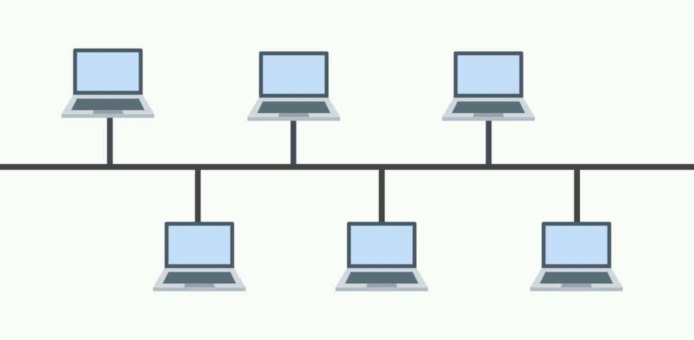
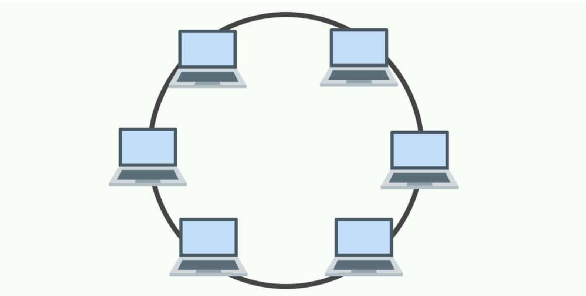

## BUS Topology

Bus topology is a network type in which every computer and network device is connected to single cable. When it has exactly two endpoints, then it is called Linear Bus topology.It transmits data only in one direction.Every device is connected to a single cable

### Disadvantage

1) Cables fails then whole network fails.
2) Cable has a limited length.

## RING Topology

It is called ring topology because it forms a ring as each computer is connected to another computer, with the last one connected to the first. Exactly two neighbours for each device.Data is transferred in a sequential manner that is bit by bit. Data transmitted, has to pass through each node of the network, till the destination node.The transmission is unidirectional, but it can be made bidirectional by having 2 connections between each Network Node, it is called Dual Ring Topology.

### Disadvantage

1) Failure of one computer disturbs the whole network.
2) Adding or deleting the computers disturbs the network activity.
