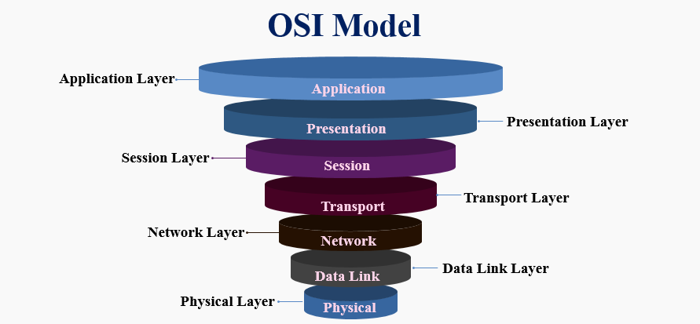

## OSI Model

The Open Systems Interconnection (OSI) model describes seven layers that computer systems use to communicate over a network. It was the first standard model for network communications, adopted by all major computer and telecommunication companies in the early 1980s

The modern Internet is not based on OSI, but on the simpler TCP/IP model. However, the OSI 7-layer model is still widely used, as it helps visualize and communicate how networks operate, and helps isolate and troubleshoot networking problems.

### Now let's talk about the different layers of the OSI model, one by one

There are 7-layers in OSI model :

1) Physical Layer
2) Data-Link Layer
3) Network Layer
4) Transport Layer
5) Session Layer
6) Presentation Layer
7) Application Layer

### Physical Layer

The main functionality of the physical layer is to transmit the individual bits from one node to another node.It defines the connector, the electrical cable or wireless technology connecting the devices, and is responsible for transmission of the raw data, which is simply a series of 0s and 1s, while taking care of bit rate control.